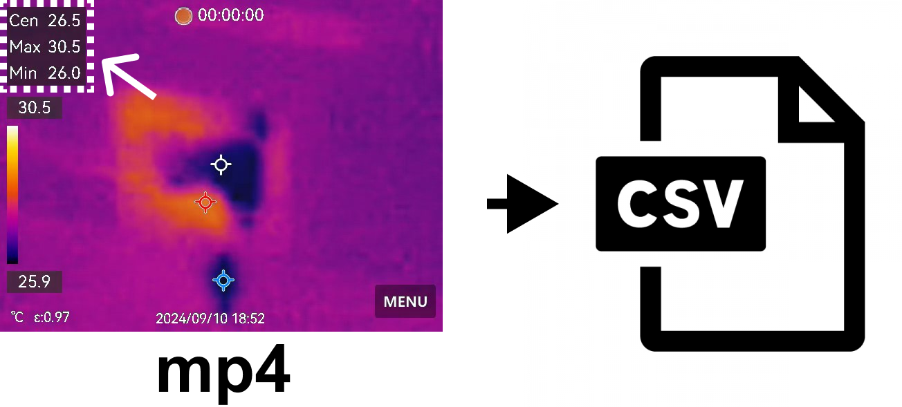

# thermal_camera_ocr


## Operation environment
- HIKMICRO Pocket2
- Windows 11

(This program can probably be excecute by other OS...)

## install
```
# (venv)
python -m venv .venv
.\.venv\Scripts\Activate.ps1

# install dependency
pip install -r .\requirements.txt
```

## usage
- input: mp4 file
- output: csv file

When yo execute below command, file exploler will launch, then select mp4 file and csv file. 
```
python main.py
```